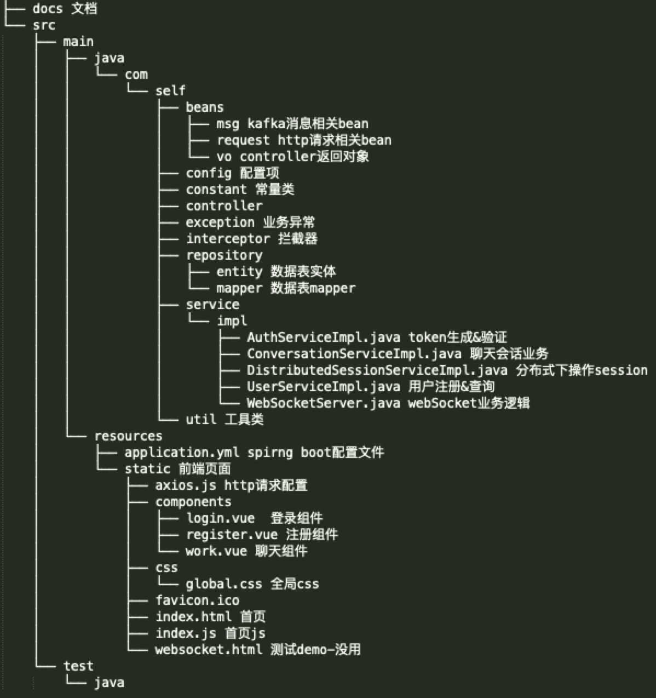
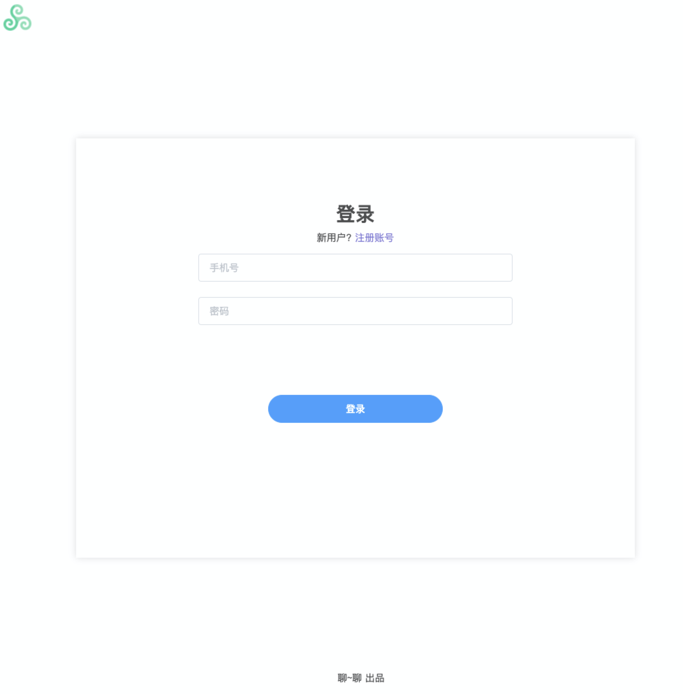
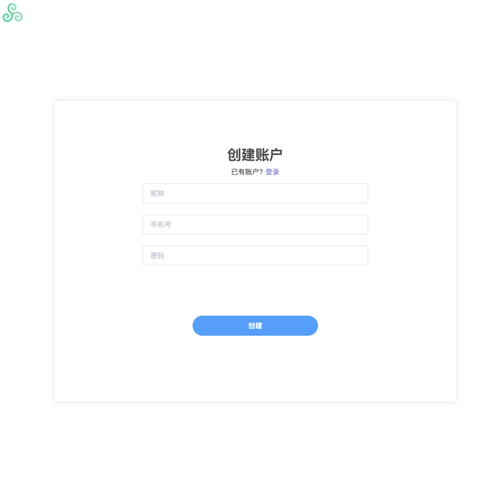
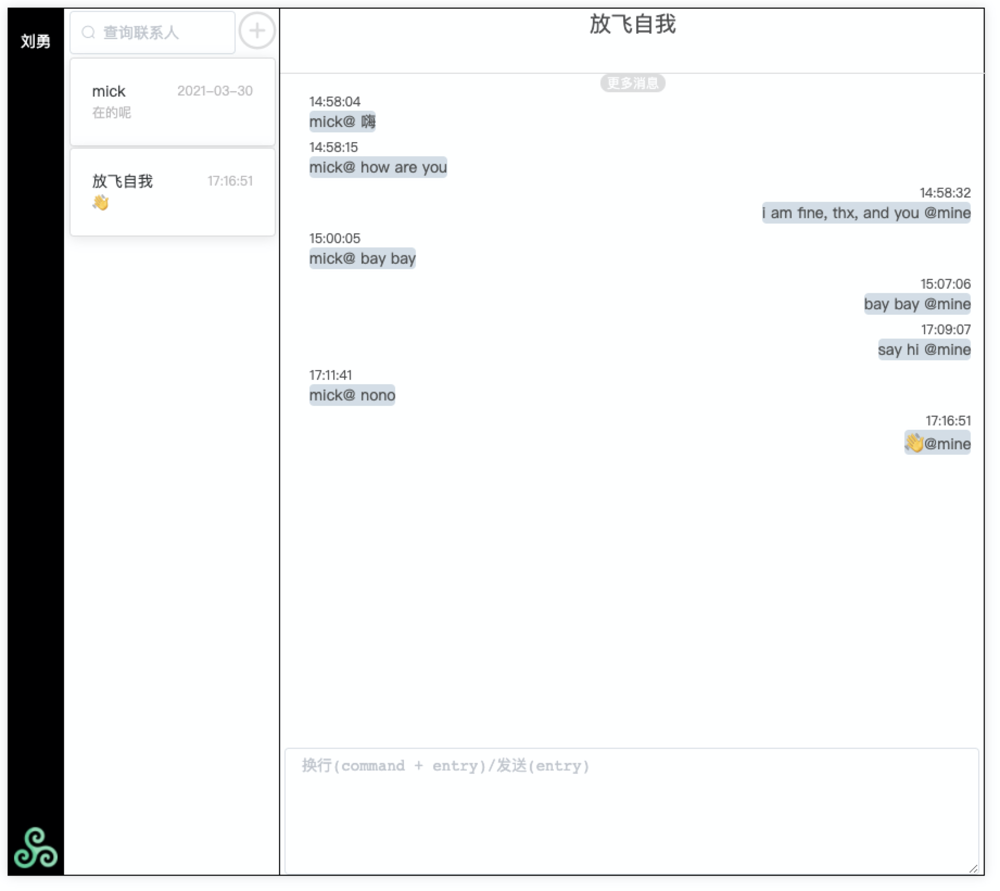
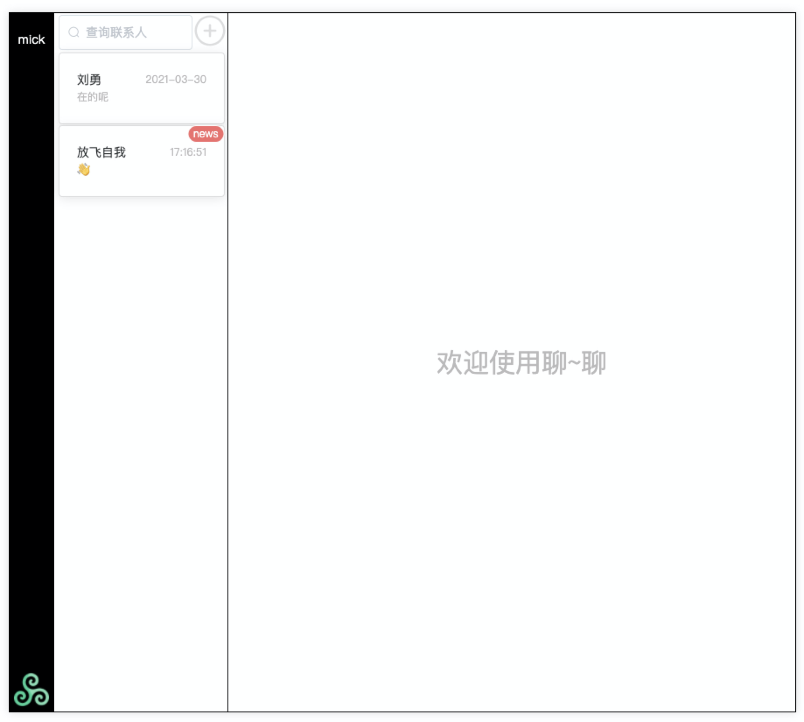
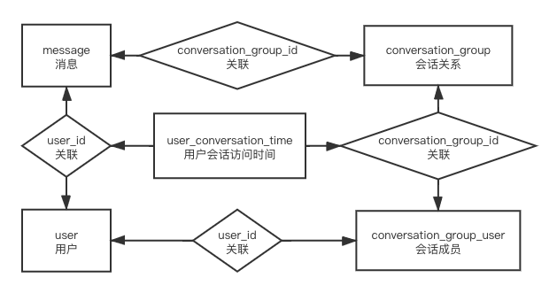
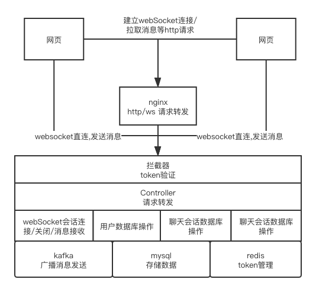

# 网页版文本聊天工具
### 功能:
    1. 点对点聊天
    2. 群聊天
### 限制:
    当前版本只支持文本消息

### 技术选型
    1. 前端
        1.1 vue 
        1.2 vue-router - 路由
        1.3 http-vue-loader - 不适用vue-cli情况下让vue文件可以运行
        1.4 axios http请求客户端
        1.5 element-ui ui框架
        1.6 websocket - 实时通讯协议
    2. 后端
        2.1 spring-boot 2
        2.2 spring-boot-websocket
        2.3 mysql - 数据存储
        2.4 redis - token验证与自动过期
        2.5 kafka - 分布式环境下session会分别在多台机器，因此推送消息时需要所有机器都触发操作，topic=chart
        2.6 maven

### 项目目录简绍

### 项目启动
    1. 请修改axios.js文件中axios.defaults.baseURL前端请求地址为部署地址
    2. 准备mysql redis kafka(创建topic=chart)
    3. 编译项目
    4. 指定机器唯一标识并启动 例如:java -Dchart.machine=chart1 -jar ./ChartTools-1.0-SNAPSHOT.jar
    5. 访问页面(如果为本地启动则访问: http://localhost:9999/index.html)

### 项目页面展示

### 数据表简绍
用户表(user)

|  字段   | 含义  |
|  ----  | ----  |
| id  | 主键 |
| nick_name  | 昵称 |
| phone_num  | 手机号 - 未加密 |
| pass_word  | 密码 - 未加密 |
| create_time  | 创建时间戳 |
| update_time  | 更新时间戳 |

消息表(message)

|  字段   | 含义  |
|  ----  | ----  |
| id  | 主键 |
| conversation_group_id  | 会话关系表id |
| user_id  | 用户表id |
| msg  | 消息内容 |
| timestamp  | 发送消息时间戳 |

会话关系表(conversation_group)

|  字段   | 含义  |
|  ----  | ----  |
| id  | 主键 |
| type  | 会话类型 1-单聊 2-群聊 |
| name  | 会话名称, 单聊为空/群聊为群名称 |
| create_time  | 创建时间戳 |

会话成员表(conversation_group_user)

|  字段   | 含义  |
|  ----  | ----  |
| id  | 主键 |
| conversation_group_id  | 会话关系表id |
| type  | 会话类型 1-单聊 2-群聊 |
| user_id  | 用户表id |

用户会话访问时间表(user_conversation_time)

|  字段   | 含义  |
|  ----  | ----  |
| id  | 主键 |
| conversation_group_id  | 会话关系表id |
| user_id  | 用户表id |
| timestamp  | 用户访问该会话最后的时间戳 |

### 数据表关系图

### 数据流转图

### 遗留问题
    1. 启动时是否有未读消息状态未查询